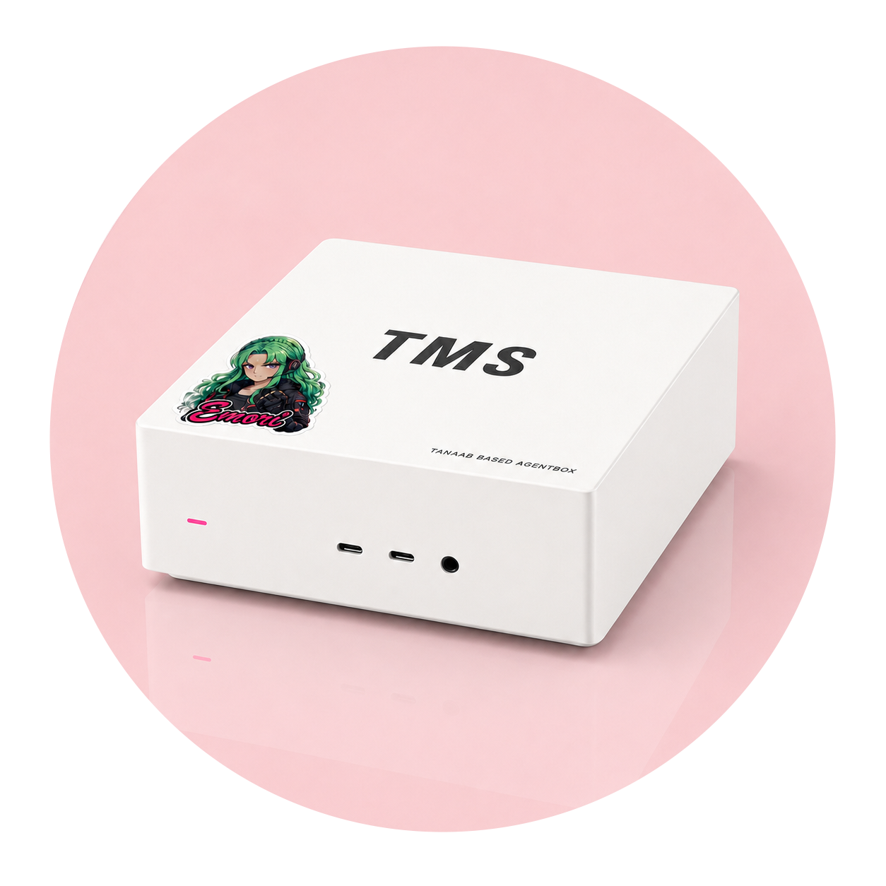

# `agentbox`

<p align="center">
  <picture>
    <source media="(prefers-color-scheme: dark)" srcset="./assets/agentbox-dark.png" />
    <source media="(prefers-color-scheme: light)" srcset="./assets/agentbox-light.png" />
    
  </picture>
</p>

<p align="center">
  <a href="https://github.com/tanaabased/agentbox/releases"></a>
  <a href="https://app.netlify.com/projects/tanaab-agentbox-sh/deploys"></a>
  
  
</p>

`agentbox` prepares a Mac to become a managed, headless OpenClaw host, optionally connected to your
[Tailscale](https://tailscale.com/) tailnet. Its goal is to take a fresh box from zero to a running
OpenClaw Gateway with reasonable security defaults and a host ready for agent workspaces.

> Supports macOS 26.x on `x64` and `arm64`.
> Requires a sudo-capable admin user and physical or admin recovery access.
> Best run on a fresh Mac dedicated to the OpenClaw host role.
>
> **Platform note:** Linux and Windows are not supported yet; Linux support is planned.

## Overview

At a high level, `agentbox`:

- installs [Homebrew](https://brew.sh/) and core dependencies from [`Brewfile`](./Brewfile)
- creates or reuses a non-admin OpenClaw runner user
- sets macOS system identity and headless power, time, and recovery defaults
- enables classic SSH
- stages OpenClaw's native user LaunchAgent and enables runtime-user autologin by default
- installs health checks and logs for post-bootstrap verification
- optionally installs SSH public keys and hardens SSH to key-only access
- optionally runs a managed `tailscaled` daemon and connects the Mac to a tailnet
- optionally configures initial OpenClaw model auth

For a more complete look at installed components, see
[ADVANCED.md#what-gets-installed](./ADVANCED.md#what-gets-installed).

## Quickstart

Complete the [Preflight Checks](./ADVANCED.md#preflight-checks) first, then run the hosted bootstrap
on the Mac you are preparing:

```sh
/bin/bash -c "$(curl -fsSL https://agentbox.tanaab.sh/macos.sh)" agentbox \
  --tailscale-authkey "$TS_AUTHKEY" \
  --openclaw-identity "A Tanaab-based Claw <openclaw>" \
  --openclaw-password "$OPENCLAW_PASSWORD"
```

The OpenClaw runner password is used only when creating the runner account or configuring autologin.
`agentbox` never prints, persists, generates, or debug-logs that password. Autologin is enabled by
default so the Gateway returns after reboot; this reduces physical-access security even though the
runner remains non-admin. FileVault is incompatible with this unattended-recovery profile.

For the complete option and environment-variable contract, run:

```sh
/bin/bash -c "$(curl -fsSL https://agentbox.tanaab.sh/macos.sh)" agentbox --help
```

Codex is optional. For guided executable management, bootstrap or reconciliation, and host-health
diagnosis, see the [Codex plugin guide](./CODEX.md).

## Usage

For repeated use, install the hosted script as a local command in a directory you manage on `PATH`:

```sh
mkdir -p "$HOME/.local/bin"
curl -fsSL https://agentbox.tanaab.sh/macos.sh -o "$HOME/.local/bin/agentbox"
chmod +x "$HOME/.local/bin/agentbox"

agentbox --help
```

Run it with flags when you want to keep the command explicit:

```sh
agentbox \
  --tailscale-authkey "$TS_AUTHKEY" \
  --openclaw-password "$OPENCLAW_PASSWORD" \
  --hostname TANAABAGENTBOX1
```

Common inputs:

| Option                   | Environment variable            | Description                                                                                          |
| ------------------------ | ------------------------------- | ---------------------------------------------------------------------------------------------------- |
| `--hostname`             | `AGENTBOX_HOSTNAME`             | macOS hostname and Tailscale hostname source.                                                        |
| `--tailscale-authkey`    | `AGENTBOX_TAILSCALE_AUTHKEY`    | Tailscale auth key for first join; use `off`, `false`, `no`, `0`, or `null` to skip Tailscale setup. |
| `--authorized-key`       | `AGENTBOX_AUTHORIZED_KEY`       | Public SSH key or public-key file path; providing keys also enables key-only SSH hardening.          |
| `--openclaw-password`    | `AGENTBOX_OPENCLAW_PASSWORD`    | Password used only for OpenClaw runner creation or autologin.                                        |
| `--openclaw-identity`    | `AGENTBOX_OPENCLAW_IDENTITY`    | OpenClaw runner identity in `Full Name <shortname>` syntax.                                          |
| `--openclaw-autologin`   | `AGENTBOX_OPENCLAW_AUTOLOGIN`   | Runtime-user autologin: `on` or `off`; defaults to `on` for unattended reboot recovery.              |
| `--openclaw-auth-choice` | `AGENTBOX_OPENCLAW_AUTH_CHOICE` | Initial OpenClaw model auth choice; defaults to `skip`.                                              |
| `--brewfile`             | `AGENTBOX_BREWFILE`             | Extra Brewfile sources to append after the core `agentbox` Brewfile.                                 |
| `--yes`                  | `NONINTERACTIVE`                | Skip interactive prompts.                                                                            |
| `--debug`                | `AGENTBOX_DEBUG`                | Show debug output with secrets masked.                                                               |

Use [ADVANCED.md](./ADVANCED.md) for the full option guide, payload-resolution details, brewgroup
behavior, OpenClaw auth environment handling, and deeper Tailscale notes.

## Verification

At the end of setup, `agentbox` prints a concise health success or failure status. A failed health
check exits nonzero and prints the report command below; `--debug` includes the full health report in
the setup output.

When the optional Codex plugin is installed, the preferred guided verification path is to run Codex
on the local agentbox host and ask:

```text
Use $tanaab-agentbox-doctor to inspect this local agentbox host.
```

The doctor reads agentbox's administrator-readable health snapshot without sudo, presents grouped
status, and recommends focused repairs without applying them. Reboot the Mac, confirm the dedicated
runtime user logs in automatically and the native Gateway returns healthy, then rerun the doctor.

Without Codex, use the installed health script directly:

```sh
sudo /opt/tanaab/agentbox/bin/health.sh --check
sudo /opt/tanaab/agentbox/bin/health.sh --report
```

`--check` exits nonzero when required checks fail. `--report` prints the same line-oriented report
without failing so it can be collected for troubleshooting.

See [ADVANCED.md#verification-details](./ADVANCED.md#verification-details) for the periodic log,
manual follow-up checks, and direct report interpretation.

## Optional Codex Plugin

The optional plugin layers three guided workflows over the same bootstrap and installed health
contracts:

- `$tanaab-agentbox-installer` installs or selects stable and source `agentbox` executables.
- `$tanaab-agentbox` plans and runs bootstrap or reconciliation with the selected executable.
- `$tanaab-agentbox-doctor` inspects one local host and recommends focused remediation.

The hosted script remains the primary setup path and does not require Codex. See
[CODEX.md](./CODEX.md) for plugin installation, example prompts, workflow boundaries, and version
alignment.

## Development

This repo uses Bun for repo-local tooling and publishes a Netlify-ready `dist/` directory.

```sh
git clone https://github.com/tanaabased/agentbox.git
cd agentbox
bun install
bun run lint
```

`bun run build` regenerates `dist/` for release-shaped verification. Local agents should not run it
or edit `dist/` unless the task explicitly requires generated output.

Leia examples run in GitHub Actions on fresh macOS runners because the mutating scenarios configure
system settings, Homebrew packages, SSH, launchd, and Tailscale.

## Issues, Questions and Support

Use the [GitHub issue queue](https://github.com/tanaabased/agentbox/issues) for bugs, regressions, or
feature requests.

## Changelog

See [`CHANGELOG.md`](./CHANGELOG.md) for release history and
[GitHub releases](https://github.com/tanaabased/agentbox/releases) for published artifacts.

## Maintainers

- [@pirog](https://github.com/pirog)

## Contributors

<a href="https://github.com/tanaabased/agentbox/graphs/contributors">
  
</a>

Made with [contrib.rocks](https://contrib.rocks).
